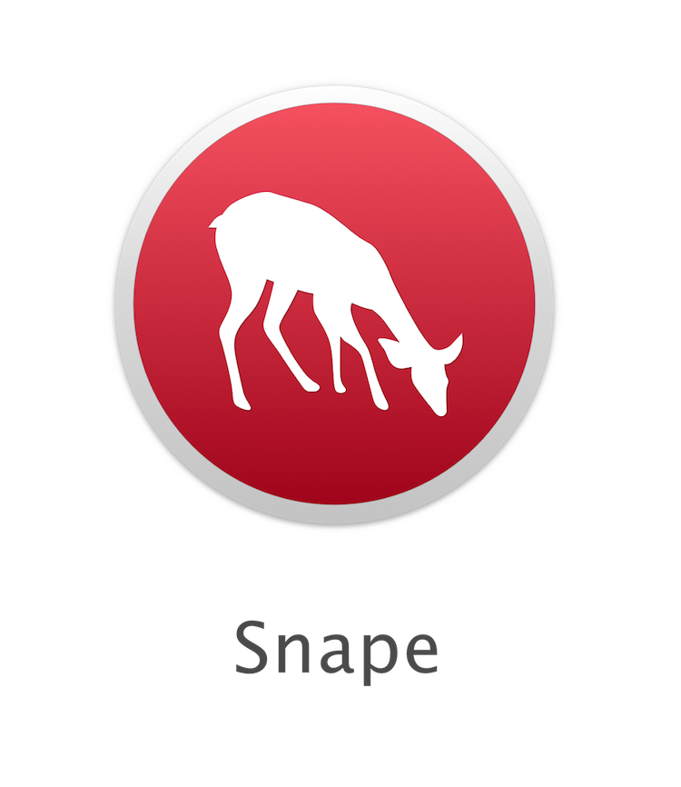
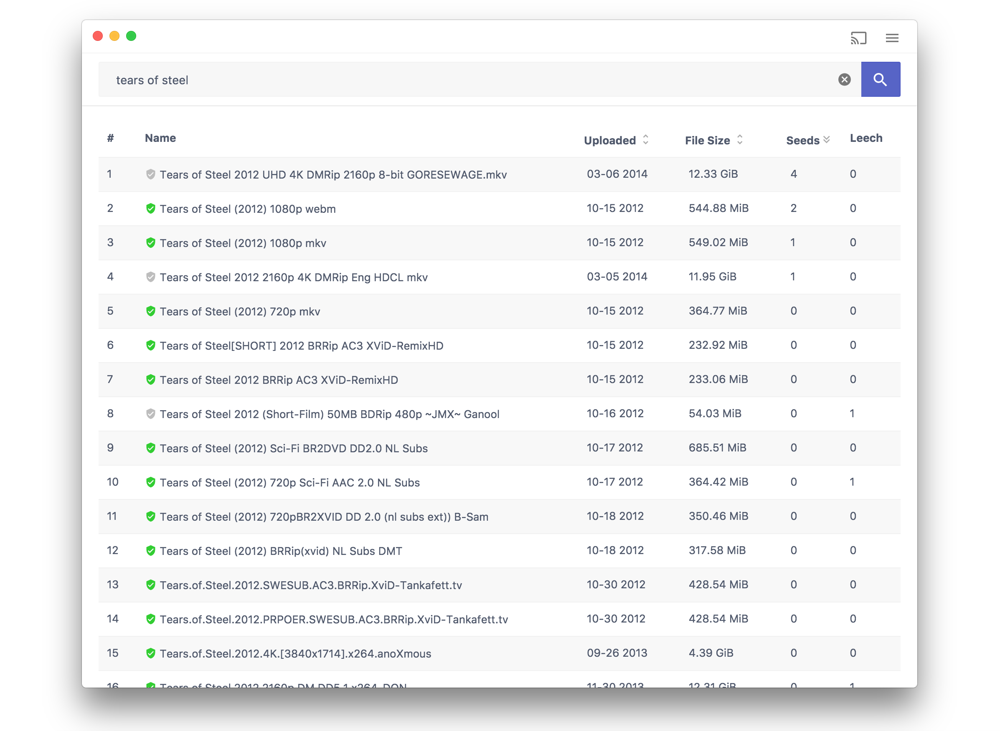
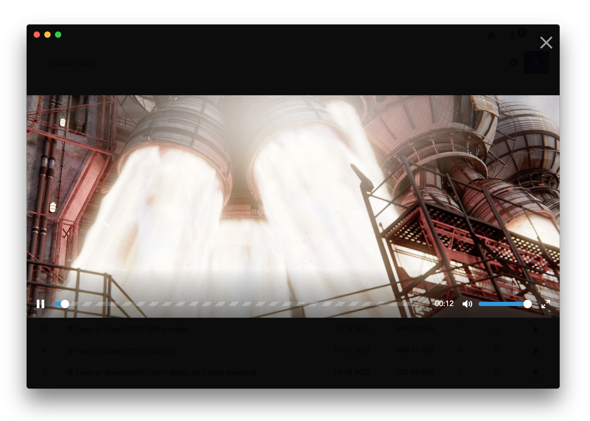

<p align="center">
  
</p>

<p align="center">
<a href="https://travis-ci.org/ritz078/embed.js">

</a>
<a href="https://ci.appveyor.com/project/ritz078/snape-w59ql">

</a>

</p>

> A torrent client for web with search and stream functionality.

<p align="center">
  
</p>

<p align="center">
  
</p>

### Features
- [x] Search a torrent. 
- [x] Stream videos and view images.
- [x] Filter Torrents
- [x] get files by magnet link
- [x] Download files
- [x] Play music
- [x] Chromecast support
- [ ] View files like pdf, text etc.

### Development

#### Caught a bug?

1. [Fork](https://help.github.com/articles/fork-a-repo/) this repository to your own GitHub account and then [clone](https://help.github.com/articles/cloning-a-repository/) it to your local device
2. Install the dependencies: `yarn`
3. Start the app: `yarn start`

To make sure that your code works in the bundled application, you can generate the binaries like this:

```bash
yarn pack
```

After that, you'll find them in the `./dist` folder!

### Credits

The logo has been designed by [Jacqueline Fernandes](https://thenounproject.com/jacquelinefernandes/)

### License 
MIT

