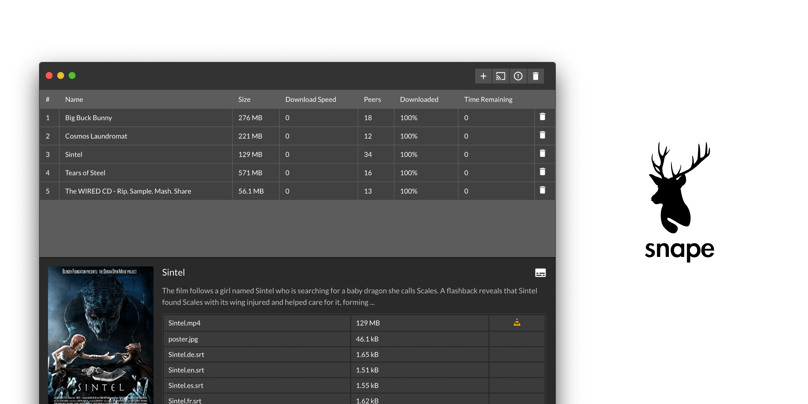

---

<a href="https://www.producthunt.com/posts/moose-2?utm_source=badge-featured&utm_medium=badge&utm_souce=badge-moose-2" target="_blank"></a>

A torrent client to download, stream and cast torrents.

### Features

- **Stream**: 👁 No need to wait for the torrent to download. You can stream the videos inside the app as soon as the torrent starts downloading.
- **Subtitles**: 📖 Automatically load the subtitles if they are present in the torrent.
- **VLC**: You can open any video file in the VLC as soon as it starts downloading.
- **External apps**: 💪 All the files can be opened in the default app on your device.
- **Theme**: 🎨 You can select any color in the preferences panel and the UI will look good in most of them because the whole UI has been designed using opacities.
- **Cast**: 📺 You can cast the video or audio to any chromecast or DLNA enabled device.
- **Music**: 🎶 You can play audio inside the app itself.

## Development

- Clone the repo
- Run `yarn` && `yarn dev` to start development. This will open a dev build of the app.
- This project uses [nextron](https://github.com/saltyshiomix/nextron) so everything mentioned there applies on this project.
- You can build this project using `yarn build:mac`. Make sure you turn off signing in `electron-builder.yml` by setting `mac.identity` to `null`

```diff
mac:
+ identity: null
  icon: resources/moose.icns
```

In case you are trying to build for some other platform, you will have to add a script to the `package.json` file. The scripts can be found [here](https://github.com/saltyshiomix/nextron#build-options)

### Logo Credits

The logo has been designed by [Philip Glen](https://thenounproject.com/pglenn/)

## Contributors ✨

Thanks goes to these wonderful people ([emoji key](https://allcontributors.org/docs/en/emoji-key)):

<!-- ALL-CONTRIBUTORS-LIST:START - Do not remove or modify this section -->
<!-- prettier-ignore-start -->
<!-- markdownlint-disable -->
<table>
  <tr>
    <td align="center"><a href="https://riteshkr.com"><br /><sub><b>Ritesh Kumar</b></sub></a><br /><a href="https://github.com/ritz078/moose/commits?author=ritz078" title="Code">💻</a> <a href="#design-ritz078" title="Design">🎨</a> <a href="#ideas-ritz078" title="Ideas, Planning, & Feedback">🤔</a> <a href="#infra-ritz078" title="Infrastructure (Hosting, Build-Tools, etc)">🚇</a></td>
    <td align="center"><a href="http://www.ateev.in"><br /><sub><b>Ateev</b></sub></a><br /><a href="https://github.com/ritz078/moose/commits?author=ateev" title="Code">💻</a></td>
    <td align="center"><a href="https://github.com/vinodf2f"><br /><sub><b>Vinod Yevatikar</b></sub></a><br /><a href="https://github.com/ritz078/moose/commits?author=vinodf2f" title="Code">💻</a></td>
    <td align="center"><a href="https://github.com/hierror"><br /><sub><b>Hierro Duarte</b></sub></a><br /><a href="https://github.com/ritz078/moose/commits?author=hierror" title="Code">💻</a></td>
  </tr>
</table>

<!-- markdownlint-restore -->
<!-- prettier-ignore-end -->

<!-- ALL-CONTRIBUTORS-LIST:END -->

This project follows the [all-contributors](https://github.com/all-contributors/all-contributors) specification. Contributions of any kind welcome!
